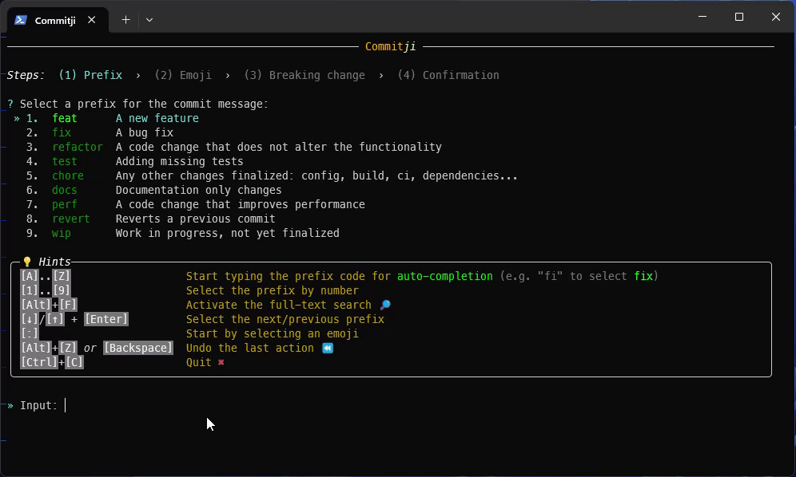

# Commitji


[](https://www.nuget.org/packages/Commitji.Cli)


> Kind of lightweight combination of [Commitizen](https://commitizen.github.io/cz-cli/) with [Gitmoji](https://gitmoji.dev/)
> to facilitate writing [conventional commit](https://github.com/angular/angular/blob/main/contributing-docs/commit-message-guidelines.md)
> messages supported by [semantic release](https://semantic-release.gitbook.io/semantic-release) and including an emoji
> compatible with the commit type.



## Issues at stake

### Tools

You may have a preferred tool to create commits.

For instance, on Windows, I use [GitExtensions](https://gitextensions.github.io) 🤩: practical
_(as long as you don't mind using the mouse)_ and powerful user-interface for `git`.

<details>
<summary>✨ <i>Example of GitExtensions features I used daily regarding commits</i></summary>

- stage/unstage many/all files at once,
- stage/unstage only some lines in a file, by selecting the lines and using the keyboard shortcut `[S]` or `[U]`,
- select a previous commit messages,
- amend the previous commit,
- get auto-completion with the name of the changed file while typing the commit message,
- create a branch before committing,
- visualize the differences without whitespaces changes,
- display the differences in WinMerge (`[F3]`).

</details>

👉 Commitji is not a replacement for such a tool, it is complementary to it, to help you write commit messages:

1. You start in your usual tool to refine the changes you want to commit,
2. You run `commitji` in a (separate) terminal to get the commit message template,
3. You get back to your tool to paste the template, complete it to get a full commit message, and commit the changes.

### Conventions

Following a convention in your commit messages helps to read the commit history. But there are several conventions:

- [Conventional Commits](https://www.conventionalcommits.org) uses prefixes like `feat`, `fix`, etc.
- [Gitmoji](https://gitmoji.dev/) uses emojis to indicate the type of change.

Both are interesting, but they are not compatible with each other. Moreover, only a subset of the conventional commits
template is supported by [semantic release](https://semantic-release.gitbook.io/semantic-release).

👉 Commitji allows you to get the best of the three worlds, by following conventional commits compatible with semantic release,
while using emojis to clarify the type of change, to end up with this template:

```txt
<prefix>: <emoji> #description
<BLANK LINE>
[BREAKING CHANGE: #explanation]
```

### Prefix

The `<prefix>`, called `type` in conventional commits, indicates the type of change.

There are 10 prefixes available, almost all directly supported by semantic release:

- The more important: `feat`, `fix`, `refactor`, `test`.
- The other prefixes: `chore`, `docs`, `perf`, `revert`, `tidy`, `wip`.

Note that there are no `build`, `ci`, `style`.

- `build` and `ci` can be included
  - in the `<scope>` of the `chore` prefix, e.g. `chore(build): ⬆️ bump dependencies`
  - in the `#description`, e.g. `chore: 🐛 fix CI build`
- `style` is confusing and not needed:
  - When it means a change in the code style, we can use `refactor` instead.
  - When it's used for a change in the UI style, it's probably rather a `feat` or a `fix` that you can complement with an UI emoji:
    - `dizzy    :` 💫 Add or update animations and transitions.
    - `iphone   :` 📱 Work on responsive design.
    - `lipstick :` 💄 Change the UI visually but not it's behaviour.

### Emoji

The `<emoji>` complements the `<prefix>`. It is placed in front of the description to clarify the type of change.

There are 75 emojis available, most of them from Gitmoji. It is quite a lot.

- If you know well some emojis, you may start by selecting the emoji, and then the prefix amongst those compatibles.
- Otherwise, it is usually more convenient to start with the prefix, and then select the emoji.

👉 Commitji related features:

- _Start step:_
  - By default, you start by selecting the prefix.
  - It's possible to switch to start by selecting the emoji.
- _Quick search:_ the selection is made with the keyboard, by starting to type the emoji/prefix code \
  e.g. Type `spa` to select `sparkles ✨`.

Gitmoji indicates the emoji codes used on GitHub. But, they may differ on other platforms you are more accustomed to,
like the OS of your mobile phone or the emoji picker on Windows 11 (`[Windows]+[.]`). For instance, the
[_Check Mark Button_ ✅](https://emojipedia.org/check-mark-button#technical) has the code `:white_check_mark:` on GitHub,
but it is `check mark button` on Windows 11, and is also known as _Green Tick_.

👉 Commitji related features:

- The emoji is inserted in the commit message as a Unicode character, not as a code. \
  ☝️ The emoji code displayed can be shortened for practical reasons, e.g. just `check_mark`.
- _Full-text search_ : what you type is searched inside the code and the description \
  e.g. Type `depe` to select a change related to a dependency:
  - `arrow_down       :` ⬇️ Downgrade dependencies.
  - `arrow_up         :` ⬆️ Upgrade dependencies.
  - `heavy_minus_sign :` ➖ Remove a dependency.
  - `heavy_plus_sign  :` ➕ Add a dependency.
  - `pushpin          :` 📌 Pin dependencies to specific versions.
- [v1.2] support of more codes, including aliases specified in [Emojipedia](https://emojipedia.org/) \
  e.g. Type `tick` to select either `lipstick 💄` or `check_mark ✅`.
- [v1.3] auto-expanding search: if what you have typed does not match the current search mode or the current start step,
  before indicating that no match is found, the tool tries to auto-expand the search mode and/or the current start step
  to match the input.

### Breaking change

The `BREAKING CHANGE` is an optional section to indicate a breaking change.

👉 Commitji ensures the compatibility with semantic release:

- it's placed on a separate line
- there are no `!` at the end of `type` (e.g. `feat!`)
  - 💡 the emoji `boom` 💥 is used instead to get the same effect

☝️ Indicate a breaking change wisely: it's not just about a technical change that may break the code; it should be
related to an improvement in your product that is worth the migration cost for your users.

🔗 [Practical vs. Strict Semantic Versioning](https://aaronstannard.com/oss-semver/)

## Installation

Commitji is available as a .NET global tool. You can install it using the following command:

```powershell
dotnet tool install --global Commitji.Cli
```

## Run

### Run in a terminal

You can run Commitji with the command `commitji` in a terminal. But notice that it will clear the console!

### Run in a dedicated windows

There are several ways to run Commitji in a dedicated windows.

For instance on Windows you can use the command `cmd.exe /c "title Commitji && commitji"`.

- `/c` is to close the windows at the end. Use `/k` if you want to keep it open.
- `title Commitji` is just to ensure that the windows will have a nice title.

### Run in GitExtensions

[GitExtensions](https://gitextensions.github.io) allows to define a custom script and to attach a hotkey to run it.

1. In _Settings > Scripts_, add a script with the following properties. Then, press `[OK]` (and not `[Apply]`) to save the settings.
   - Name: Commitji
   - Command: `$host.UI.RawUI.WindowTitle = 'Commitji'; commitji`
   - Is PowerShell script: True
2. In _Settings > Hotkeys_, attach a keyboard shortcut to run the previous script \
   💡 for instance `[Ctrl]+[.]` _(`[OemPeriod]`),_ in reference to `[Win]+[.]` to open the emoji picker in Windows 11.

Then, when you want to commit your changes, you can press:

- `[Ctrl]+[Space]` to open the _Commit_ popup
- `[Ctrl]+[.]` to open _Commitji_
- complete all steps until the commit message template copied in the clipboard
- paste it in the _Commit message_ text area

## Usage

### Steps

The tool display a series of questions, mainly to allow you to choose:

- a prefix (`feat`, `fix`...) and an emoji amongst a short list of relevant emojis (e.g. `sparkles` ✨ for `feat`)
- or an emoji (`lipstick` 💄) and a prefix amongst a short list of relevant prefixes (e.g. `feat` or `fix`)

The default mode is to start with the prefix selection. You can switch to emoji selection by pressing `[:]`.

When you have both the prefix and the emoji, you can indicate if it's a breaking change.

Afterward, the corresponding semantic version change is indicated (Major, Minor, Patch, None),
and the commit message template is displayed. You can copy it to the clipboard by pressing `[Enter]`.

### Behaviors

The selection is made in various ways:

- You can navigate through the list of available choices, using the arrow keys `[↓]/[↑]` to change the selected choice.
- And/or you can start typing the number of the choice to select (when numbers are displayed: for prefixes and emojis).
- And/or you can start typing some characters: the list of choices is filtered to match the input.
  - If a single choice matches the input, the step is auto-completed, the input is cleared, and you go to the next step.
  - If multiple choices match:
    - The portions that match the input are highlighted.
    - You can complete the step by pressing `[Enter]`.

The search is case-insensitive, and has 2 modes:

- Quick search: the input is matched against the beginning of the choice code.
- Full-text search: the input is matched against the whole choice text.
- You can switch to full-text search by pressing `[Alt]+[F]` (or `[Ctrl]+[F]` when it's not intercepted by the host).
- You can exit the full-text search by pressing `[Alt]+[F]` again (or `[Escape]` when it's not intercepted by the host).

💡 In the quick search mode, if your input matches nothing, the mode is automatically expanded to full-text and a new search is performed. You will the new matches, if any. If not, the mode will automatically return to quick search mode.

At any time, you can press:

- `[Alt]+[Z]` or `[Backspace]` to undo the last action (if any).
- `[Ctrl]+[C]` to close the tool.

💡 These keystrokes are indicated in the hints panel that is updated to match the input and the selection.
